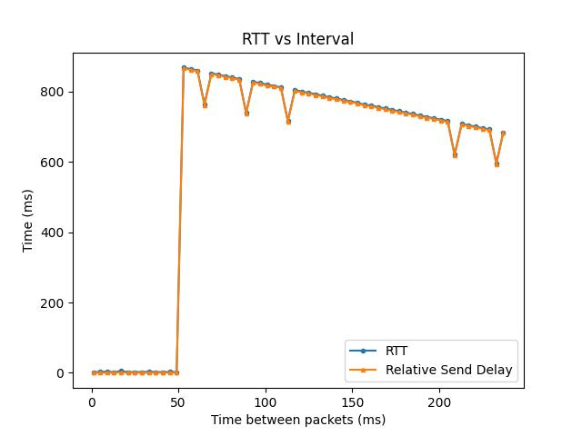
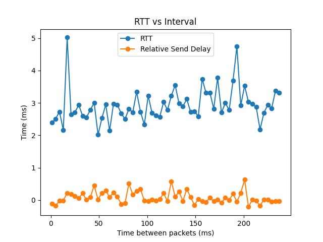

# Latency Test
Simple test for benchmarking UDP latency on an ESP32, specifically testing recieving packets at different intervals.

All results should be taken as rough estimates not absolute values.

# Testing

After some initial testing using `ping.py`, the most stable rtt results seemed to be from <10ms intervals while discarding the first result. Using these as a baseline, a value can be calculated that shows how "normal" a latency is. 

In graphs this reffered to as `Send Delay`, Positive numbers represent higher latency in the PC -> ESP step compared to the baseline offset. Negative numbers represent better than baseline performance on that transmission side.

## Setup
All tests were run on an [ESP32C3-Supermini](https://www.aliexpress.us/item/3256801447048789.html), about 2 ft away from a dedicated router with only the testing PC via Ethernet and ESP32 via WiFi connected. 

During and in between tests nothing moved in the room, including electronics or people.

All tests were performed after ESP32 had atleast 5 minutes after connecting to wifi to come to operating temperature in free standing air.

## Results
The radio sleep time appears to have massive effects on latency, mostly resulting in negative effects beyond 50ms packet intervals. These negative effects can reliably be over 800ms, and in some rare cases up to 2400ms.

**All data for graphs can be found in the `media` directory.**

Feel free to use the `render.py` script to explore the data further or view differently.

### Relative Send Delay **IS NOT** an absolute measure of latency.
Relative Send Delay is only a measure of how different recieving side latency is from the best case baseline. Found by averaging the results of a best case to get a clock offset and assuming the clocks are synced enough for the short duration of these tests.

### Default Radio Sleep Settings

This graph shows that with default settings, if packets arrive at a frequency of less than 20Hz a massive latency is incurred. 

The Relative Send Delay follows the round trip time (RTT) closely, which indicates that this latency is purely in the MCU's recieve portion of the RTT cycle.

On an interesting note, the linear trend in the latter half as well as the offset points are highly repeatable. The slope indicates an x intercetp of about 920ms, so can likely be approximated to roughly a second given accuracies of this test. While the offset points are at intervals:
 - [65, 89, 113, 209, 233] (milliseconds)

### Radio Sleep Disabled

By disabling radio sleep the above graph is produced. 

Please note that the Relative Send Delay is only a measure of how different single side latency is from the best case baseline. **IT IS NOT** an absolute measure of latency.

# Usage
> Platformio

Use ESP32C3 target or add your own (any esp32 model should work)

> Python

- `ping.py`: Sends a burst of packets at a fixed interval
- `run.py`: Gathers an average latency at range of intervals, dumps to `output.csv`
- `render.py`: Plots `output.csv` using matplotlib